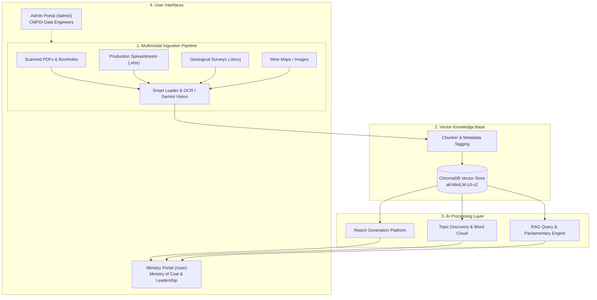

# 🏛️ CMPDI GeoAI Hub — AI-Powered Geological & Mining Reporting Solution

[](https://www.sih.gov.in/)
[](https://coal.nic.in/)
[](https://www.cmpdi.co.in/)
[]()
[](https://fastapi.tiangolo.com/)
[](https://ai.google.dev/)

> **Prototype for Smart India Hackathon (SIH) | Problem Statement ID: 26023**  
> **Problem Title:** AI-Powered Geological, Mining and other Reporting Solution for CMPDI/CIL subsidiaries  
> **Target Organization:** Ministry of Coal / Coal India Limited (CIL) / Central Mine Planning & Design Institute (CMPDI)

---

## 📌 Executive Summary

CMPDI and CIL subsidiaries (ECL, BCCL, CCL, WCL, SECL, MCL, NCL, NEC) handle vast volumes of geological exploration logs, monthly production reports, borehole data, safety incident archives, and high-priority parliamentary queries. 

**CMPDI GeoAI Hub** automates this end-to-end workflow with a dual-role architecture:
1. **Admin Portal (CMPDI / CIL Data Admin)**: Multi-format document ingestion (PDF, DOCX, XLSX, PPTX, Scanned Images), automated OCR/Vision extraction, validation health, and knowledge base management.
2. **Ministry Portal (Ministry of Coal & Executives)**: AI-based RAG query engine with verbatim page-level source citations, one-click official Parliamentary Question (PQ) responses, dynamic geological/mining report generation, and interactive Word Cloud topic discovery.

---

## 🚀 Key Modules & Capabilities

### 1. 🤖 AI-Based Query & Response System (RAG)
- **Zero Hallucination with Exact Source Attribution**: Retrieves semantically relevant context chunks and provides exact file names, page numbers, and text excerpts.
- **Subsidiary-Level Filtering**: Search across all consolidated CIL subsidiaries or drill down to specific subsidiaries (e.g., SECL, MCL, BCCL, CMPDI).
- **Parliamentary Inquiry Assistant**: Formats responses according to official Lok Sabha / Rajya Sabha starred & unstarred question templates with data tables.

### 2. 📊 Automated Report Generation Platform
- Generates structured, publishable reports on demand:
  - **Parliamentary Inquiry Response Brief**
  - **Monthly Coal Production & Offtake Summary**
  - **Geological Reserve & Exploration Estimate (Proved, Indicated, Inferred)**
  - **Overburden (OB) Removal & Stripping Ratio Analytics**
- Includes Executive Summaries, Key Metrics, Challenges, Recommendations, and multi-format Export.

### 3. ☁️ Automated Word Cloud & Topic Discovery Module
- Topic clustering across historical documents (e.g., *Drilling Bottlenecks, Seam Quality, Heavy Machinery Utilization, Safety Compliance*).
- Dynamic keyword extraction and interactive visual word cloud.

### 4. 📂 Multimodal Ingestion Pipeline (Admin Portal)
- Support for **PDFs (native & scanned OCR)**, **Excel sheets (.xlsx)**, **Word documents (.docx)**, **Presentations (.pptx)**, and **Geological Maps/Images (Gemini Vision)**.
- Real-time extraction confidence scoring and ingestion health monitoring.

---

## 🏛️ System Architecture



---

## ⚡ Quantified Hackathon Benefits

| Parameter | Traditional Manual Workflow | CMPDI GeoAI Hub | Measurable Impact |
| :--- | :--- | :--- | :--- |
| **Report Preparation Time** | 2 to 5 days per report | Under 15 seconds | **> 95% Time Reduction** |
| **Parliamentary Response Time** | Hours to Days | Instant Draft with Tables | **> 90% Faster Response** |
| **Data Extraction Accuracy** | Prone to manual copy errors | OCR + AI Confidence Verification | **> 98% Extraction Accuracy** |
| **Audit Traceability** | Hard to locate physical files | Direct Page & File Citations | **100% Verifiable Source Trail** |

---

## 🛠️ Tech Stack

- **Backend**: Python 3.12+, FastAPI, Uvicorn
- **AI & LLM**: Google Gemini (gemini-3.6-flash / gemini-1.5-flash)
- **Vector Database**: ChromaDB
- **Embeddings**: `sentence-transformers` (`all-MiniLM-L6-v2`)
- **Document Extractors**: PyMuPDF (fitz), python-docx, openpyxl, python-pptx, Pillow
- **Frontend**: HTML5, Tailwind CSS, JavaScript, Lucide Icons, Chart.js

---

## 💻 Quick Start & Setup Guide

### 1. Clone the Repository
```bash
git clone https://github.com/YOUR_USERNAME/cmpdi-geoai-hub.git
cd cmpdi-geoai-hub
```

### 2. Install Dependencies
```bash
pip install -r requirements.txt
```

### 3. Configure Environment Variables
Create a `.env` file in the root directory:
```env
GEMINI_API_KEY=your_gemini_api_key_here
GEMINI_MODEL=gemini-3.6-flash
```
*(Get a free API key at [Google AI Studio](https://aistudio.google.com/app/apikey))*

### 4. Start the Application Server
```bash
python server.py
```
Or with specific Python path:
```powershell
uvicorn server:app --host 0.0.0.0 --port 8000 --reload
```

---

## 🌐 Accessing the Portals

Once the server is running, open `http://localhost:8000` in your web browser:

| Portal | URL Path | Demo Credentials | Primary Purpose |
| :--- | :--- | :--- | :--- |
| **Landing & Auth** | `http://localhost:8000/` | Select Role | Unified entry & role navigation |
| **Admin Portal** | `http://localhost:8000/admin` | `admin.cmpdi@gov.in` / `cmpdi@2024` | Ingest files, review OCR, monitor storage |
| **Ministry Portal** | `http://localhost:8000/user` | `ministry@coal.gov.in` / `coal@2024` | Q&A, Parliamentary reports, Word Cloud |

---

## 📁 Repository Structure

```
cmpdi-geoai-hub/
├── server.py              # FastAPI server handling auth, ingest, RAG, and reports
├── frontend/
│   ├── index.html         # Unified landing page & interactive prototype interface
│   ├── admin.html         # Dedicated CMPDI Admin upload & monitoring dashboard
│   └── user.html          # Dedicated Ministry of Coal inquiry & reporting portal
├── rag/
│   ├── smart_loader.py    # Multimodal parser (PDF, DOCX, PPTX, XLSX, Images, TXT)
│   ├── chunker.py         # Semantic text chunking engine
│   ├── embedder.py        # Local vector embedding generator
│   ├── vector_store.py    # ChromaDB indexing & metadata search
│   ├── chain.py           # RAG retrieval & prompt composition
│   ├── gemini_client.py   # Gemini API client with auto-retry
│   ├── analyzer.py        # Document summaries & keyword extractors
│   ├── memory.py          # Multi-turn conversational memory
│   └── report_exporter.py # Report generation logic & formats
├── requirements.txt       # Python dependencies
├── .env.example           # Example environment template
└── README.md              # Project documentation
```

---

## 👥 Authors & Acknowledgments

Built for the **Smart India Hackathon (SIH)**.  
Dedicated to modernizing the data workflows of **Coal India Limited (CIL)**, **CMPDI**, and the **Ministry of Coal, Government of India**.
